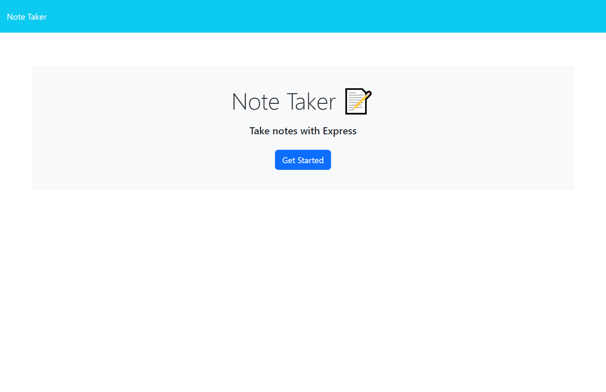
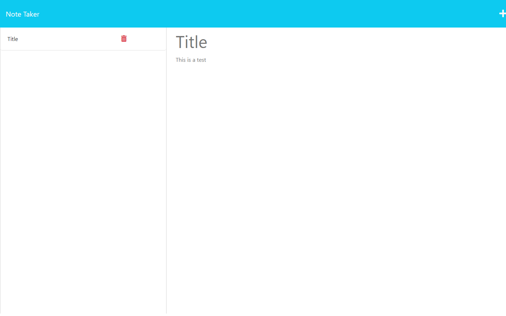
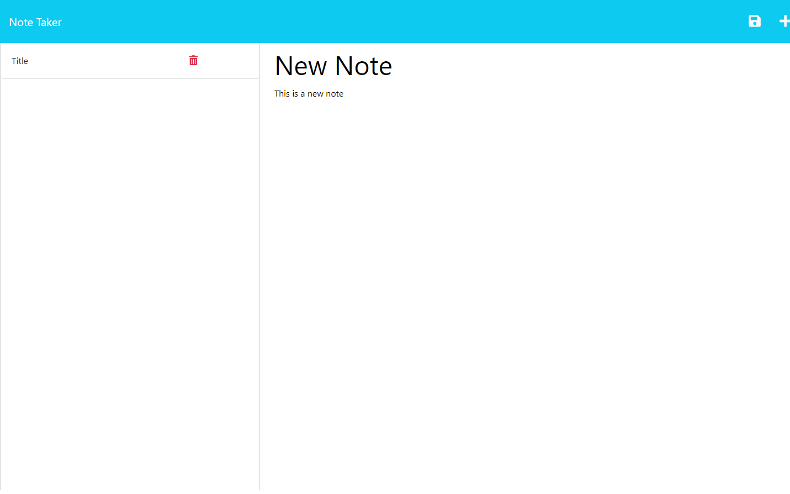

# Note Taker

# Description
- The motivation behind this project was to help the user organize his thoughts
- I built this project to help users remember the things they need to do
- This project will help the user not forget important ideas
- Creating this project helped me learn how to use express and create routes

# Usage
- Notes will be added to db.json
- Refreshing the page will show the newly added note

